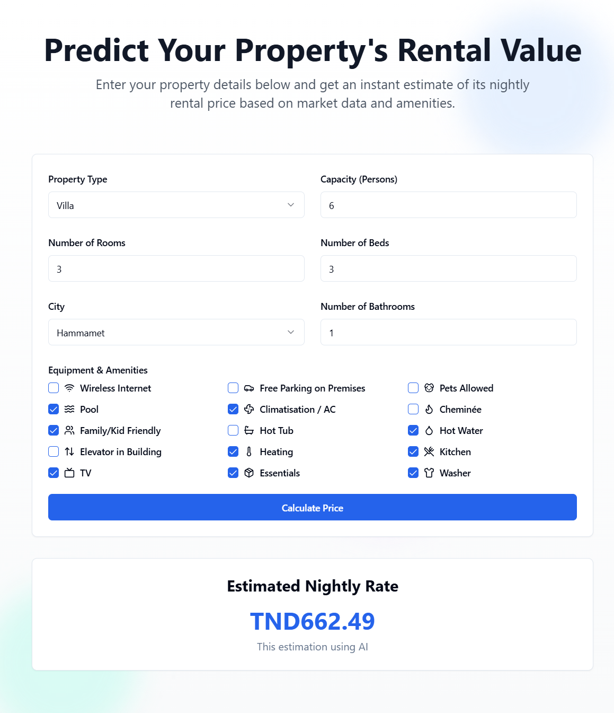

# Rent Predictor

A web application that predicts the nightly rental value of properties based on market data and amenities. Built with a modern tech stack: **Vite React** for the frontend, **Django** for the backend, and an integrated **machine learning model** to provide accurate rental predictions based on property data.



---

## Features
- **Rental Price Estimation:** Get instant rental value predictions by entering property details.
- **Dynamic Input Fields:** Customize the prediction with property type, size, location, and amenities.
- **Responsive Design:** Works seamlessly on desktop and mobile devices.
- **AI-Powered Predictions:** Leveraging machine learning for reliable and accurate results.

---

## Tech Stack
- **Frontend:** [Vite](https://vitejs.dev/) + [React](https://reactjs.org/)
- **Backend:** [Django](https://www.djangoproject.com/)
- **Machine Learning:** Integrated ML model for rental value predictions
- **Styling:** TailwindCSS

---

## Setup Instructions
### Prerequisites
Make sure you have the following installed:
- [Node.js](https://nodejs.org/) (v16 or later)
- [Python](https://www.python.org/) (v3.8 or later)
- [Django](https://www.djangoproject.com/)
- [pip](https://pip.pypa.io/)

### Clone the Repository
```bash
git clone [https://github.com/KcMelek/Rent-Predictor.git](https://github.com/KcMelek/Rent-Predictor.git)
```

### Backend Setup (Django)

1. Navigate to the backend folder:

    ```bash
    cd backend
    ```

2. Create and activate a virtual environment:

    ```bash
    python -m venv venv
    source venv/bin/activate   # On Windows, use `venv\Scripts\activate`
    ```

3. Install dependencies:

    ```bash
    pip install -r requirements.txt
    ```

4. Start the backend server:

    ```bash
    python manage.py runserver
    ```

### Frontend Setup (Vite React)

1. Navigate to the frontend folder:

    ```bash
    cd frontend
    ```

2. Install dependencies:

    ```bash
    npm install
    ```

3. Start the development server:

    ```bash
    npm run dev
    ```

## How to Use

1. Open the application in your browser.
2. Enter the property details: type, location, number of rooms, capacity, and amenities.
3. Click on the Calculate Price button.
4. View the estimated nightly rate powered by AI.

## Collaborators

- **Melek Kchaou** - Developer and collaborator
- **Baya Mezghani** - Developer and collaborator
